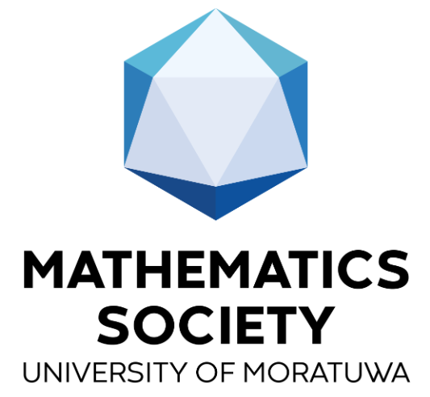

I am a Graduate Research Intern at the Bioinformatics Institute, Singapore. Currently, I am working on Multi-instance Learning and Multi-task Learning based models for Computational Pathology, under the supervision of <a href="https://scholar.google.com.sg/citations?user=9ebsWAoAAAAJ&hl=en">Dr. Lee Hwee Kuan</a>. My recent research interests lie in pattern recognition in histopathological images. More broadly, I am keen on studying statistical learning theory and applying theoretical knowledge to develop tools and frameworks for biomedical/ biological image analysis.

&nbsp;

	I completed my Bachelors in Biomedical Engineering (BME) with First Class Honors at the Department of Electronic and Telecommunication Engineering (ENTC), University of Moratuwa, Sri Lanka and received the gold medal for the best academic performance in the BME specialization. My undergraduate thesis project was on "Deep Geometric Framework to Predict Antibody-Antigen Binding Affinity" under the supervision of <a href = 'https://scholar.google.no/citations?user=VhyUxgcAAAAJ&hl=en'> Dr. Subodha Charles</a>. This research project was a collaboration with <a href="https://www.linkedin.com/in/ravinda-munasinghe-658a9982/">Dr. Aravinda Munasinghe</a>, Senior Research Scientist at Pfizer Inc., USA. During the undergraduate internship at Effective Solutions (Pvt) Ltd., Sri Lanka, I deployed deep-learning based models to predict Diabetic Retinopathy severity and segment neovascularization using fundus images. Further, as self-initiated research projects, I have worked on developing a paediatric anaesthesia monitoring system using EEG and ECG signals. 

&nbsp;
 

<!--  -->
 

&nbsp;

News
====
	
 

   <table style = "border: none;width: 100%">
	<colgroup>
       		<col span="1" style="width: 20%;">
       		<col span="1" style="width: 80%;">
    	</colgroup>

     	
	<tr>
    		<td style = "border: none;color:blue;font-size:17px;">November 2023</td>
    		<td style = "border: none;font-size:17px;"> Joined the <b>Bioinformatics Institute</b>, A*STAR, Singapore as a <b>Graduate Research Intern</b>.</td> 	
	</tr>
	

 	<tr>
    		<td style = "border: none;color:blue;font-size:17px;">July 2023</td>
    		<td style = "border: none;font-size:17px;"> Joined the <b>University of Moratuwa</b>, Sri Lanka as a <b>Visiting Instructor.</b></td> 	
	</tr>
    
	<tr>
    		<td style = "border: none;color:blue;font-size:17px;">June 2023</td>
    		<td style = "border: none;font-size:17px;"> Presented the undergraduate thesis project to the <a href="https://ent.uom.lk/"><b>Department of Electronic and Telecommunications Engineering</b></a> at the University of Moratuwa, Sri Lanka.</td> 	
	</tr>

    
	<tr>
    		<td style = "border: none;color:blue;font-size:17px;">September 2022</td>
    		<td style = "border: none;font-size:17px;"> Placed among the <b>top 5</b> solutions at the IEEE Video and Image Processing Cup (<b>VIPCUP 2022 - Open Competition</b>).</td> 	
	</tr>  

	<tr>
			<td style = "border: none;color:blue;font-size:17px;">July 2022</td>
    		<td style = "border: none;font-size:17px;"> <b>CAMSAT</b>: Paediatric Anaesthesia Monitoring System won the <b>1st runners-up</b> award at the <a href="https://ent.uom.lk/spark-at-uom/spark-challenge-2021-22-results/"><b>SPARK Challenge 2021/22</b></a>.</td>

	</tr>
 
	
 	<tr>
    		<td style = "border: none;color:blue;font-size:17px;">November 2022</td>
    		<td style = "border: none;font-size:17px;"> Joined <b> Centre for Advanced Imaging at Harvard University </b> as a <b> Remote Undergraduate Research Fellow </b>, under supervision of <b> Dr. Dushan. N. Wadduwage</b> from Wadduwage Lab, focusing on deep learning based image reconstruction algorithms for microscopy.</td> 	
	</tr>	

	<tr>
    		<td style = "border: none;color:blue;font-size:17px;">January 2022</td>
    		<td style = "border: none;font-size:17px;"> co-authored paper: <a href="https://www.computer.org/csdl/proceedings-article/icpr/2022/09956238/1IHpg8unl4c"><b>HPGNN: Hierarchical Point GNN for Outdoor Point Cloud processing</b></a> accepted at <b>ICPR 2022.</b></td> 	
	</tr>

    
	<tr>
    		<td style = "border: none;color:blue;font-size:17px;">December 2021</td>
    		<td style = "border: none;font-size:17px;"> Joined the School of Computer Science, <b>University of Sydney</b> as a <b>Research Intern.</b></td> 	
	</tr>
	   
	   
	   
	
	<tr>
    		<td style = "border: none;color:blue;font-size:17px;">July 2021</td>
    		<td style = "border: none;font-size:17px;"> Virtually attended ICASSP 2021 to defend our solution to the <a href="https://signalprocessingsociety.org/community-involvement/ieee-signal-processing-cup-2021"><b>IEEE Signal Processing Cup</b></a>, and Won the global chanpionship</td> 	
	</tr>

	<tr>
    		<td style = "border: none;color:blue;font-size:17px;">May 2021</td>
    		<td style = "border: none;font-size:17px;"> Appointed as <b> Assitant Manager </b> of the Knowledge Hub of the Electronic Club.</td> 	
	</tr>
	

	<tr>
    		<td style = "border: none;color:blue;font-size:17px;">October 2018</td>
    		<td style = "border: none;font-size:17px;"> Started my undergraduate degree in Electronic and Telecommunications Engineering at University of Moratuwa, Sri Lanka.</td> 	
	</tr>
   </table> 
 

