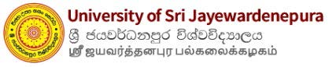
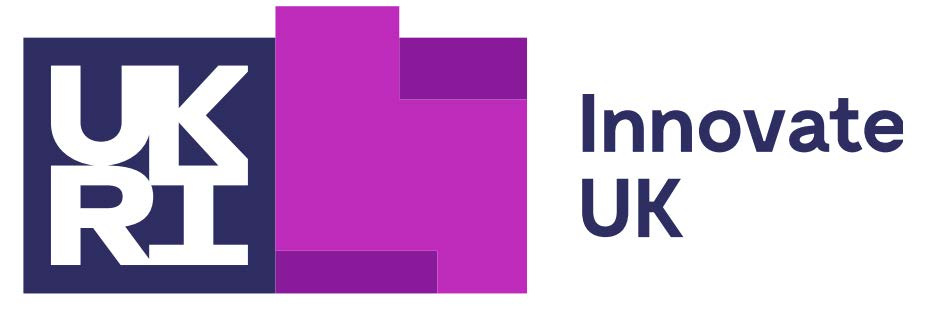

I am a Graduate Research Engineer at University of Sri Jayewardenepura, Sri Lanka. Currently, I am working on electric conversion of IC engine tuk-tuks, which are a popular method of public transportation in Sri Lanka. It is a Research Project funded by Innovate UK – Energy Catalyst Round 9 – Early-Stage competition funding, Collaboration with University of Surrey (UK), Alta Vision Solar (PVT) Ltd (SL). My recent research interests lie in alternative fuels, and renewable energy. More broadly, I am keen on studying automotive powertrain, combustion, and applying mechanical design knowledge to develop practical solutions to achieve sustainable transportation.

&nbsp;

	I completed my Bachelors in Mechanical Engineering (ME) with First Class Honors at the Department of Mechanical Engineering (DoME), University of Moratuwa, Sri Lanka. My self-initiated undergraduate thesis project was on "Investigating Vehicle Yaw Stability with Active Steering and Torque Vectoring" under the supervision of <a href = 'https://scholar.google.com/citations?user=kDf7wTIAAAAJ&hl=en&oi=ao'> Dr. J. R. Gamage</a>. During the undergraduate internship at Diesel and Motor Engineering (DIMO) PLC., Sri Lanka, I obtained hands on experience working on many automotive engine models, and learned preventive maintenance work carried on vehicles. I was awarded the Migara Ratnatunga Trust Awards on Industrial Training for University Undergraduates - 2021 / 2022 (Field - Mechanical Engineering) , presented by Institution of Engineers Sri Lanka (IESL).

&nbsp;
 

<!--  -->
 

&nbsp;

News
====
	
 

   <table style = "border: none;width: 100%">
	<colgroup>
       		<col span="1" style="width: 20%;">
       		<col span="1" style="width: 80%;">
    	</colgroup>

    <tr>
    		<td style = "border: none;color:blue;font-size:17px;">December 2023</td>
    		<td style = "border: none;font-size:17px;"> Awarded the <b>Gold Medal</b> for the highest overall academic performance in Biomedical Engineering at the 44th General Convocation of the University of Moratuwa, Sri Lanka.</td> 	
	</tr>

	<tr>
    		<td style = "border: none;color:blue;font-size:17px;">November 2023</td>
    		<td style = "border: none;font-size:17px;"> Joined the <b>Bioinformatics Institute</b>, A*STAR, Singapore as a <b>Graduate Research Intern</b>.</td> 	
	</tr>

 	<tr>
    		<td style = "border: none;color:blue;font-size:17px;">July 2023</td>
    		<td style = "border: none;font-size:17px;"> Joined the <b>University of Moratuwa</b>, Sri Lanka as a <b>Visiting Instructor.</b></td> 	
	</tr>
    
	<tr>
    		<td style = "border: none;color:blue;font-size:17px;">June 2023</td>
    		<td style = "border: none;font-size:17px;"> Presented the undergraduate thesis project to the <a href="https://ent.uom.lk/"><b>Department of Electronic and Telecommunications Engineering</b></a> at the University of Moratuwa, Sri Lanka.</td> 	
	</tr>

	<tr>
    		<td style = "border: none;color:blue;font-size:17px;">September 2022</td>
    		<td style = "border: none;font-size:17px;"> Placed among the <b>top 5</b> solutions at the IEEE Video and Image Processing Cup (<b>VIPCUP 2022 - Open Competition</b>).</td> 	
	</tr>  

	<tr>
			<td style = "border: none;color:blue;font-size:17px;">July 2022</td>
    		<td style = "border: none;font-size:17px;"> <b>CAMSAT</b>: Paediatric Anaesthesia Monitoring System won the <b>1st runners-up</b> award at the <a href="https://ent.uom.lk/spark-at-uom/spark-challenge-2021-22-results/"><b>SPARK Challenge 2021/22</b></a>.</td>

	</tr>

	<tr>
			<td style = "border: none;color:blue;font-size:17px;">June 2022</td>
    		<td style = "border: none;font-size:17px;"> Submitted the preprint of the co-authored paper: <a href="https://www.researchgate.net/publication/368642404_Rethinking_Object_Detection_in_terms_of_Classification_and_Localization_through_Parallel_Deep_Learning_Models"><b>Rethinking Object Detection in terms of Classification and Localization through Parallel Deep Learning Models</b></a> for <b>ICIP 2022</b> review.</td>

	</tr>
    
	<tr>
    		<td style = "border: none;color:blue;font-size:17px;">January 2022</td>
    		<td style = "border: none;font-size:17px;"> Joined <b>Effective Solutions (Pvt) Ltd.</b>, Sri Lanka as a <b>Research Intern</b> in Biomedical Engineering.</td> 	
	</tr>
	   
	<tr>
			<td style = "border: none;color:blue;font-size:17px;">November 2021</td>
    		<td style = "border: none;font-size:17px;"> Won the <b>1st runners-up</b> award at the <a href="https://uom.lk/elect/news_events/team-stimulus-university-moratuwa-wins-first-prize-3rd-regional-association"> 3rd International Energy and Electricity Market Business Decision
			Simulation Competition</a>.</td>
	</tr>   
	   
	<tr>
    		<td style = "border: none;color:blue;font-size:17px;">September 2020</td>
    		<td style = "border: none;font-size:17px;"> Appointed as the<b> Vice President </b>of the <b>Mathematics Society</b> of University of Moratuwa, Sri Lanka.</td> 	
	</tr>
	
	<tr>
    		<td style = "border: none;color:blue;font-size:17px;">October 2018</td>
    		<td style = "border: none;font-size:17px;"> Started my Bachelors degree in Biomedical Engineering at University of Moratuwa, Sri Lanka.</td> 	
	</tr>
   </table> 
 

