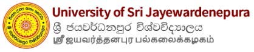
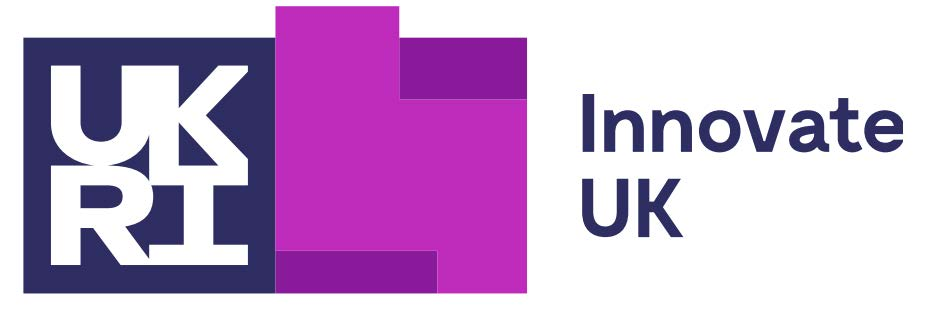

I am a Lecturer in the Department of Mechanical Engineering at the University of Moratuwa, Sri Lanka. My research interests lie in automotive engineering, with a particular focus on hydrogen-fueled internal combustion engines, alternative-fuel combustion, powertrain systems, and vehicle dynamics. Through my research, I aim to contribute to the development of cleaner, high-efficiency propulsion technologies that support the transition toward sustainable transportation.

&nbsp;

	I graduated with First Class Honours in Mechanical Engineering from the University of Moratuwa, Sri Lanka. My undergraduate thesis, "Investigating Vehicle Yaw Stability with Active Steering and Torque Vectoring," was a self-initiated research project supervised by two senior lecturers. During my industrial training at Diesel & Motor Engineering PLC (DIMO), I gained practical experience in automotive engine systems, vehicle maintenance, and diagnostics across a range of vehicle platforms. In recognition of my industrial training performance, I was awarded the Migara Ratnatunga Trust Award for Industrial Training (Mechanical Engineering), 2021/2022, presented by the Institution of Engineers Sri Lanka (IESL).

&nbsp;
 

<!--  -->
 

&nbsp;

<h1>News </h1> 
	
 

   <table style = "border: none;width: 100%">
	<colgroup>
       		<col span="1" style="width: 20%;">
       		<col span="1" style="width: 80%;">
    </colgroup>

	<tr>
    		<td style = "border: none;color:blue;font-size:17px;">March 2024</td>
    		<td style = "border: none;font-size:17px;"> Presented research publication on <b>"Assessing the Viability of Renewable Energy Integration in Battery Swappable Conversion Kits for Tuk-tuks in Sri Lanka"</b> at ICGEA 2024, held in <em>Singapore</em>.</td> 	
	</tr>

    <tr>
    		<td style = "border: none;color:blue;font-size:17px;">November 2023</td>
    		<td style = "border: none;font-size:17px;"> Awarded the <b>1st Place</b> for the "Best Presentation" in Automotive Track (Graduate) at ICIET 2023, organised by the Faculty of Technology, University of Sri Jayewardenepura (SL).</td> 	
	</tr>

	<tr>
    		<td style = "border: none;color:blue;font-size:17px;">August 2023</td>
    		<td style = "border: none;font-size:17px;"> Awarded the <b>Migara Ratnatunga Trust Awards on Industrial Training</b> for University Undergraduates - 2021 / 2022 (Field - Mechanical Engineering) , presented by the <em>Institution of Engineers Sri Lanka (IESL)</em>.</td>
	</tr>

 	<tr>
    		<td style = "border: none;color:blue;font-size:17px;">August 2023</td>
    		<td style = "border: none;font-size:17px;"> Joined the <b>University of Sri Jayewardenepura</b>, Sri Lanka as a <b>Research Engineer (Mechanical).</b></td> 	
	</tr>
    
	<tr>
    		<td style = "border: none;color:blue;font-size:17px;">July 2023</td>
    		<td style = "border: none;font-size:17px;"> Appointed as the <b>Treasurer</b> for the year 2023 - 24 at <em>Rotaract Club of Alumni of University of Moratuwa</em>.</td> 	
	</tr>  

	<tr>
    		<td style = "border: none;color:blue;font-size:17px;">June 2023</td>
    		<td style = "border: none;font-size:17px;"> Presented the undergraduate thesis project to the <a href="https://uom.lk/mech"><b>Department of Mechanical Engineering</b></a> at the University of Moratuwa, Sri Lanka.</td> 	
	</tr>

	<tr>
    		<td style = "border: none;color:blue;font-size:17px;">July 2022</td>
    		<td style = "border: none;font-size:17px;"> Appointed as the <b>Sergeant at arms</b> for the year 2022 - 23 at <em>Rotaract Club of Alumni of University of Moratuwa</em>.</td> 	
	</tr>  

	<tr>
			<td style = "border: none;color:blue;font-size:17px;">Mar 2022</td>
    		<td style = "border: none;font-size:17px;"> Joined <em>Diesel and Motor Engineering (DIMO) PLC</em> as a <b>Trainee Mechanical Engineer</b>.</td>
	</tr> 

	<tr>
			<td style = "border: none;color:blue;font-size:17px;">July 2021</td>
    		<td style = "border: none;font-size:17px;"> Appointed as the <b>Director Finance</b> for the year 2021 - 22 at <em>Rotaract Club of University of Moratuwa</em>.</td>

	</tr>

	<tr>
			<td style = "border: none;color:blue;font-size:17px;">July 2020</td>
    		<td style = "border: none;font-size:17px;"> Appointed as the <b>Co-Director - Environmental avenue</b> for the year 2020 - 21 at <em>Rotaract Club of University of Moratuwa</em>.</td>

	</tr>
    
	<tr>
    		<td style = "border: none;color:blue;font-size:17px;">July 2019</td>
    		<td style = "border: none;font-size:17px;"> Appointed as the <b>Rotary Family Coordinator </b> for the year 2019 - 20 at <em>Rotaract Club of University of Moratuwa</em>.</td> 	
	</tr>  
	
	<tr>
    		<td style = "border: none;color:blue;font-size:17px;">October 2018</td>
    		<td style = "border: none;font-size:17px;"> Started my Bachelors degree in Mechanical Engineering at University of Moratuwa, Sri Lanka.</td> 	
	</tr>
   </table> 
 

