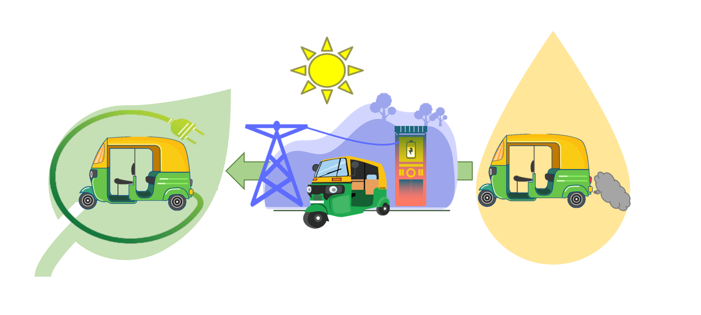
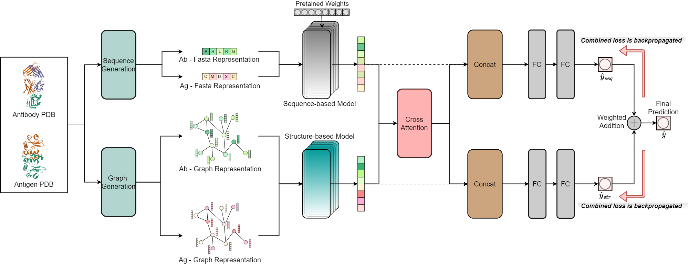
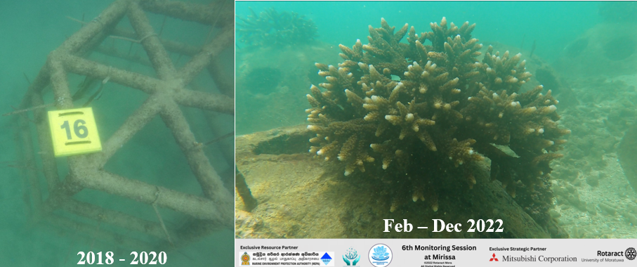

## On-going Projects
* **Renewable Energy Access for Conversion of Tuk-tuks (REACT)**
  - *Graduate Research Project(s)* 
  - **Supervisor(s)**: 
    + <a href = 'https://scholar.google.com/citations?hl=en&user=_Xh4kmMAAAAJ'>Dr Guohong Tian </a> (Senior Lecturer in Automotive Engineering), School of Mechanical Engineering Sciences, University of Surrey, UK
    + <a href = 'https://scholar.google.com/citations?hl=en&user=7exCaRIAAAAJ'>Eng. W. R. de Mel</a> (Head of the Dept. of Materials and Mechanical Technology), University of Sri Jayewardenepura, Sri Lanka

&nbsp;

* **Investigating Vehicle Yaw Stability with Active Steering and Torque Vectoring**
  - *Self-initiated Undergraduate Thesis Project* [<a href = 'https://drive.google.com/file/d/1XTN1prMfSRIv6EGzFO0Am_tIoku6PQ-M/view'>Thesis</a>]
  - *Note*: Thesis completed, research paper submitted and under review.
  - **Supervisor(s)**: 
    + <a href = 'https://scholar.google.com/citations?user=kDf7wTIAAAAJ&hl=en&oi=ao'>Dr. J. R. Gamage</a> (Senior Lecturer), University of Moratuwa, Sri Lanka
    + <a href = 'https://scholar.google.com/citations?user=r5RUaGkAAAAJ&hl=en&oi=ao'>Dr. L. U. Subasinghe </a> (Senior Lecturer), University of Moratuwa, Sri Lanka
    + <a href = 'https://scholar.google.com/citations?user=lrmg3jkAAAAJ&hl=en&oi=ao'>Mr. U. L. S. Perera</a> (PhD Student), University of Cambridge
    + <a href = 'https://scholar.google.com/citations?user=Kh4UEUQAAAAJ&hl=en&oi=sra'>Mr. N. P. Dassanayake</a> (Lecturer of Engineering Technology), University of Sri Jayewardenepura

  -- *If the image is not clear, click <a href = '../images/COMMODEL3.png'>here</a>.*

## Past Projects
* **Zooxanthallae - Reverse Engineering of Coral Structures for Coral Restoration**
  - *Voluntary, Undergraduate Research and Design Project* 
  - *The 1st phase of the project  Zooxanthellae replantation of corals was carried out in 2018. However, the deposited structure showcased minimul growth during the observation period of 2018 - 2020. Therefore, reengineered and designed new coral structures, which showed a substantial growth in the period of few months.*
  

 