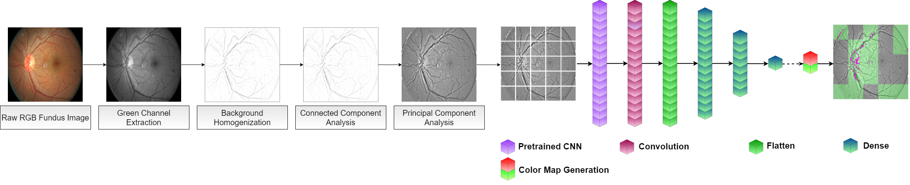
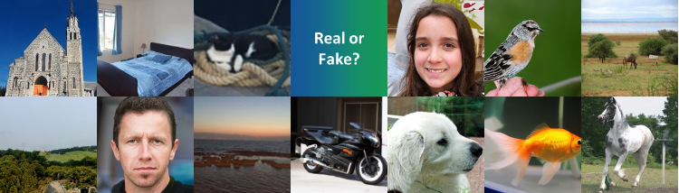
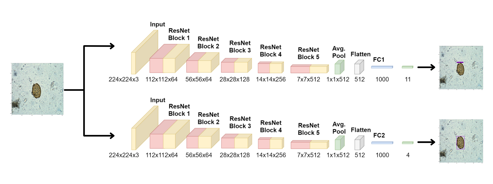
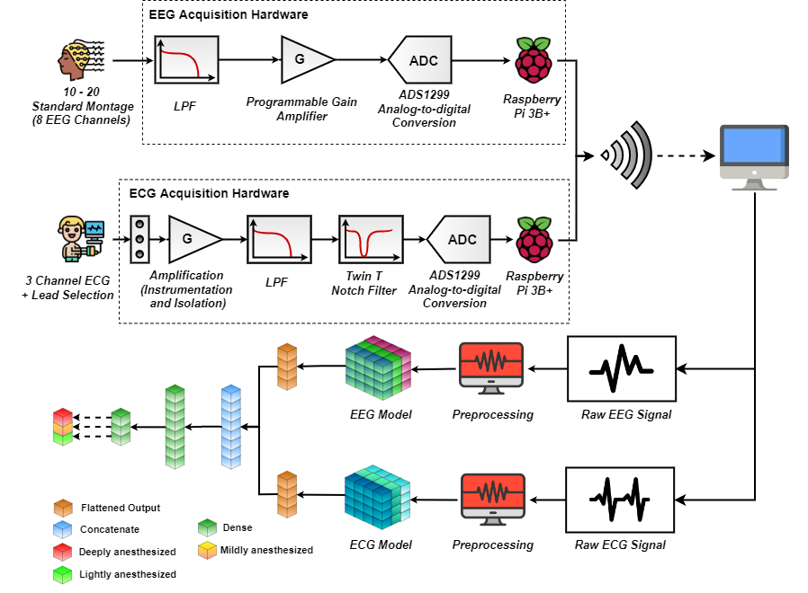
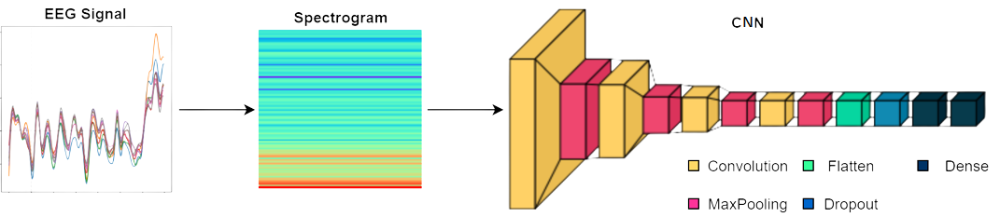

## On-going Projects
* **Renewable Energy Access for Conversion of Tuk-tuks (REACT)**
  - *Graduate Research Project(s)* 
  - **Supervisor(s)**: 
    + <a href = 'https://scholar.google.com/citations?hl=en&user=_Xh4kmMAAAAJ'>Dr Guohong Tian </a> (Senior Lecturer in Automotive Engineering), School of Mechanical Engineering Sciences, University of Surrey, UK
    + <a href = 'https://scholar.google.com/citations?hl=en&user=7exCaRIAAAAJ'>Eng. W. R. de Mel</a> (Head of the Dept. of Materials and Mechanical Technology), University of Sri Jayewardenepura, Sri Lanka

&nbsp;

* **Investigating Vehicle Yaw Stability with Active Steering and Torque Vectoring**
  - *Self-initiated Undergraduate Thesis Project* [<a href = 'https://drive.google.com/file/d/1XTN1prMfSRIv6EGzFO0Am_tIoku6PQ-M/view'>Thesis</a>]
  - *Note*: Thesis completed, research paper submitted and under review.
  - **Supervisor(s)**: 
    + <a href = 'https://scholar.google.com/citations?user=kDf7wTIAAAAJ&hl=en&oi=ao'>Dr. J. R. Gamage</a> (Senior Lecturer), University of Moratuwa, Sri Lanka
    + <a href = 'https://scholar.google.com/citations?user=r5RUaGkAAAAJ&hl=en&oi=ao'>Dr. L. U. Subasinghe </a> (Senior Lecturer), University of Moratuwa, Sri Lanka
    + <a href = 'https://scholar.google.com/citations?user=lrmg3jkAAAAJ&hl=en&oi=ao'>Mr. U. L. S. Perera</a> (PhD Student), University of Cambridge
    + <a href = 'https://scholar.google.com/citations?user=Kh4UEUQAAAAJ&hl=en&oi=sra'>Mr. N. P. Dassanayake</a> (Lecturer of Engineering Technology), University of Sri Jayewardenepura

  -- *If the image is not clear, click <a href = '../images/COMMODEL3.png'>here</a>.*

## Past Projects
* **Patchwise Localization of Neovascularization in Fundus Images Using Transfer Learning**
  - *Self-initiated, Undergraduate Research Internship Project* [<a href = 'https://drive.google.com/file/d/1pdMF5yO26JVyZqFDgYLNlMHHPxDd7Doq/view?usp=sharing'>Report</a>] 
  - **Advisor**: 
    + <a href = 'https://scholar.google.com/citations?user=481sMoEAAAAJ'>Shashika Munasingha</a> (Doctoral Candidate), Auckland Bioengineering Institute, New Zealand

  -- *If the image is not clear, click <a href = '../images/dr.png'>here</a>.*

&nbsp;

* **Feature-Fused Parallel Deep Learning Model for Generalized Synthetic Image Detection [IEEE VIPCUP 2022]**
  - *Research Competition* [<a href = 'https://drive.google.com/file/d/1TGP0_vnvKNLODO7k_Oht_m7RB2WecerR/view?usp=sharing'>Report</a>] 
  - Our method was placed in the **Top 5** solutions
  - **Advisor(s)**: 
    + <a href = 'https://scholar.google.com/citations?user=qe5byo4AAAAJ&hl=en'>Dr. Chamira Edussooriya</a> (Senior Lecturer), University of Moratuwa, Sri Lanka
    + <a href = 'https://scholar.google.com.au/citations?user=Ctp3igcAAAAJ&hl=en'>Jathushan Rajasegaran</a> (PhD Student), BAIR, University of California, Berkeley, USA

&nbsp;

* **Parasitic Egg Detection and Classification in Microscopic Images**
  - *Research Competition* [<a href = 'https://www.researchgate.net/publication/368642404_Rethinking_Object_Detection_in_terms_of_Classification_and_Localization_through_Parallel_Deep_Learning_Models'>Preliminary Report for ICIP 2022 Grand Challenge</a>] 
  - **Advisor**: 
    + <a href = 'https://scholar.google.com.sg/citations?user=9ebsWAoAAAAJ&hl=en'>Dr Rukshani Liyanaarachchi</a> (Senior Lecturer), University of Moratuwa, Sri Lanka

* **CAMSAT: Paediatric Anaesthesia Monitoring System**
  - *Self-initiated Undergraduate Research* [<a href = 'https://drive.google.com/file/d/1jPVycFGds_hssIDrzRhg9aXx7OQUle6b/view?usp=sharing'>Report</a>] 
  - Won the **1st runners-up** award at the SPARK Challenge 2021/22 - Climate Change-oriented Innovation Competition, Organized by the University of Moratuwa, Sri Lanka

&nbsp;

* **Analysis of a Vibrotactile P300 Brain-Computer Interface Dataset from a Patient with Locked-in Syndrome**
  - *Virtual Hackathon, Spring School, G.tec Medical Engineering GmbH (2022)* [<a href = 'https://drive.google.com/file/d/1nFQiUXplHLS2WWsWD4tghbT-OT4DS-on/view?usp=sharing'>Presentation</a>][<a href = 'https://github.com/Sam54000/vibro-tactile-P300-lockedIn-patient'>Github</a>] 
  - **Collaborator**: 
    + <a href = 'https://scholar.google.com/citations?user=HCm1_UkAAAAJ&hl=fr'>Samuel Louviot</a> (PhD Student),  University of Lorraine, France

