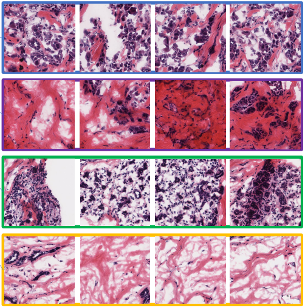

## On-going Projects
* **Multi-instance, Multi-task Learning for Cancer Histopathology Images**
  - *Graduate Research Internship Project(s)* 
  - **Supervisor(s)**: 
    + <a href = 'https://scholar.google.com.sg/citations?user=9ebsWAoAAAAJ&hl=en'>Dr. Lee Hwee Kuan</a> (Head of Research Division), Bioinformatics Institute, A*STAR, Singapore
    + <a href = 'https://github.com/sagizty'>Tianyi Zhang</a> (Research Officer), Bioinformatics Institute, A*STAR, Singapore

&nbsp;

* **Deep Geometric Framework to Predict Antibody-Antigen Binding Affinity**
  - *Undergraduate Thesis Project* [<a href = 'https://drive.google.com/file/d/1NkxO8fNq3UGV0jqNu1U2A8QNA0jpSgeo/view?usp=sharing'>Thesis</a>]
  - *Note*: Thesis completed, research paper to be submitted
  - **Supervisor(s)**: 
    + <a href = 'https://scholar.google.no/citations?user=VhyUxgcAAAAJ&hl=en'>Dr. Subodha Charles</a> (Senior Lecturer), University of Moratuwa, Sri Lanka
    + <a href = 'https://scholar.google.com/citations?user=gJ1BhRoAAAAJ&hl=en'>Dr. Aravinda Munasinghe</a> (Senior Research Scientist), Pfizer Inc., USA
    + <a href = 'https://scholar.google.com/citations?user=5ZSfU5wAAAAJ&hl=en'>Dr. Kaushalya Madhawa</a> (AI Scientist), University of Tokya, Japan

*(Click the above image to zoom)* 

## Past Projects
* **Parasitic Egg Detection and Classification in Microscopic Images**
  - *Research Competition* [[<a href = 'https://www.researchgate.net/publication/368642404_Rethinking_Object_Detection_in_terms_of_Classification_and_Localization_through_Parallel_Deep_Learning_Models'>Preliminary Report for ICIP 2022 Grand Challenge</a>]] 
  - **Supervisor**: 
    + <a href = 'https://scholar.google.com.sg/citations?user=9ebsWAoAAAAJ&hl=en'>Dr Rukshani Liyanaarachchi</a> (Senior Lecturer), University of Moratuwa, Sri Lanka

&nbsp;

