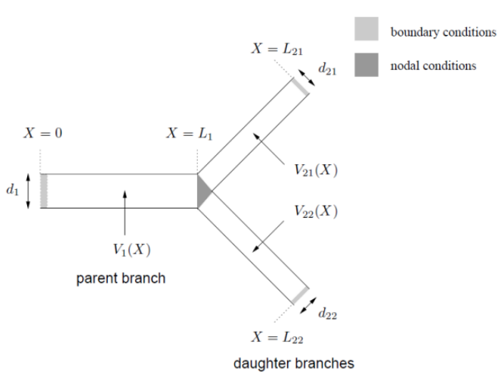
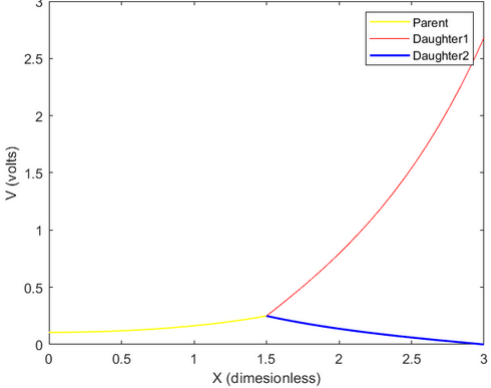
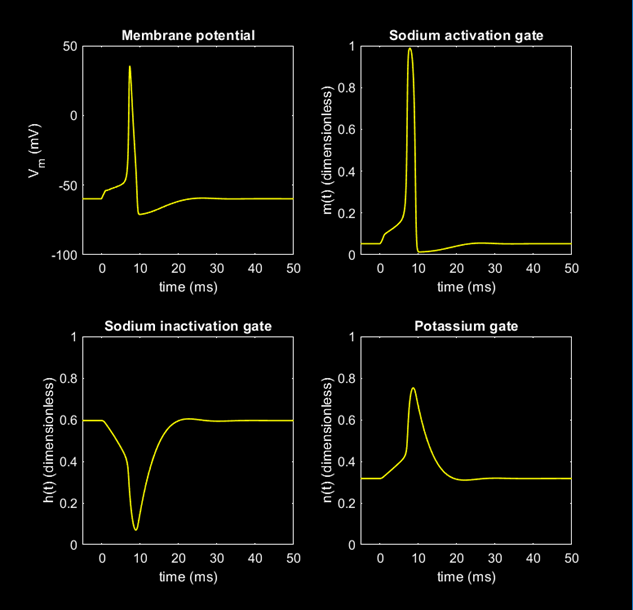
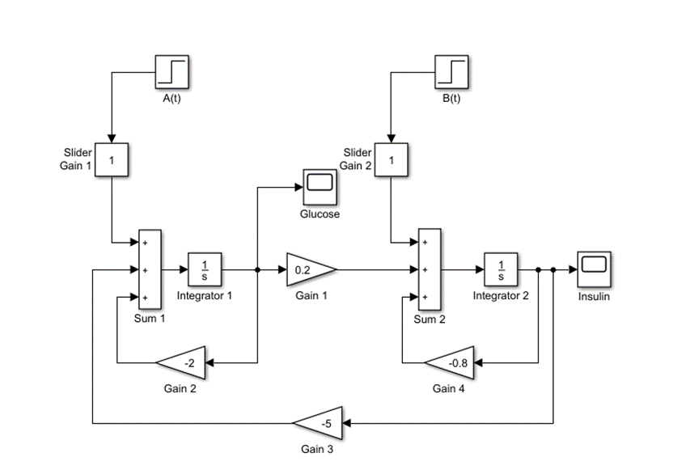
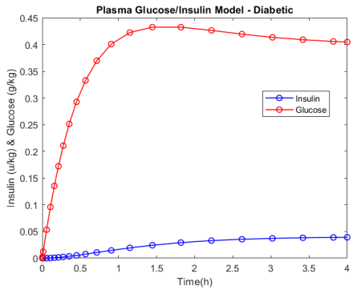
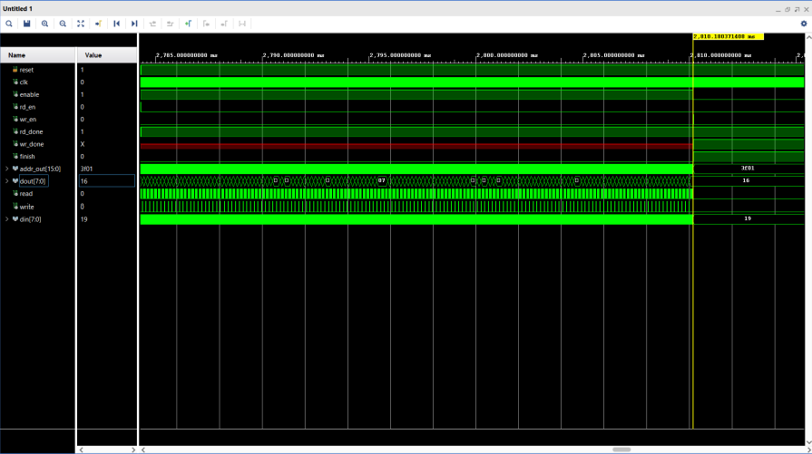
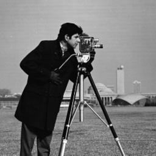
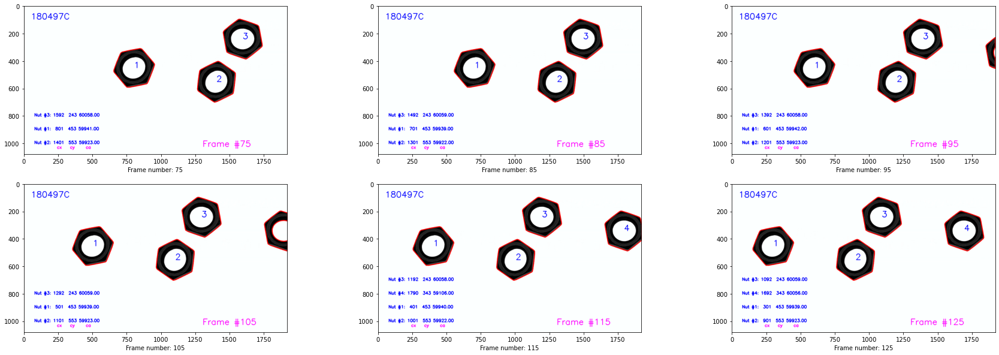

## Branched Cylinders: Dendritic Tree Approximations
Explored some of the time independent electrical properties of single branched cables. Branched cables are an important means of modelling the passive electrical properties of axonal and dendritic trees. For convenience, trees exhibiting only one order of branching were considered. Nevertheless, the principles could be easily extended to higher order trees.

In the above diagram, V1,V21 and V22 are the membrane potentials of the respective branches. d1, d21 and d22 are the diameters of the parent and daughter branches respectively and X is axial distance.

By solving the differential equations with the given nodal and boundary conditions, steady-state voltage profile in each branch could be determined. 

## Properties of the Hodgkin-Huxley equations
Many of the properties of the propagating action potential are similar to the membrane action potential. The features; <b>threshold, refractoriness</b> (absolute and relative), <b>repetitive activity, temperature dependence</b> that are observed physiologically, were simulated using the Hodgkin-Huxley equations.

## Mathematical Modelling of Compartmental Systems
Many compartmental systems can be represented by a series of first-order differential equations.
* Bolies Glucose/ Insulin Model
* Riggs Model for Iodine Metabolism

## Image Downsampling Processor
Designed and simulated/implemented a processor that could down-sample an input image using Vivado Design Suite. The input image was transmitted to the processor where the image is down-sampled and once finished, the results were sent back for display purposes.

      

Original and Downsampled Image

## Object Counting on a Moving Conveyor Belt
Hexagonal nuts on a moving conveyor belt were detected and localized from a video stream using a conventional image processing pipeline including;
* Otsu Thresholding
* Morphological Closing
* Connected Component Analysis
* Contour Analysis

