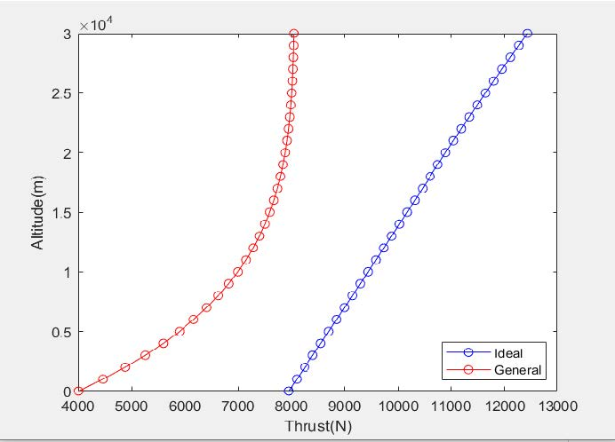
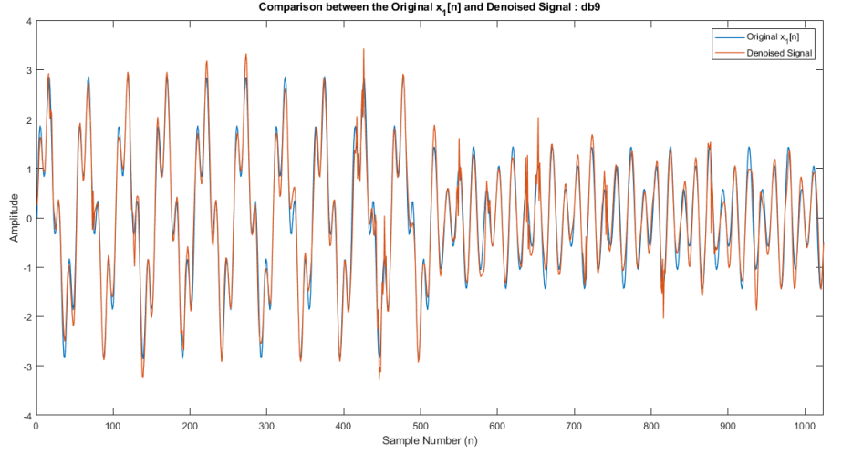

## Converging - Diverging Nozzle 
Conducted analytical calculations in Matlab for a rocket to understand the practical implications of the Converging - Diverging Nozzle. 
* Calculations were carried out for Ideal and Real condtions using;
  - Tsiolkovsky rocket equation
  - Effective Exhaust Velocity
  - Study of Flow Behaviour
* The following conditions were studied;
  - Nozzle exit diameter variation with Altitude
  - Thrust variation with Altitude under Ideal conditions
  - Thrust variation with Altitude under General conditions

For more details: <a href = 'https://drive.google.com/file/d/1zWrn285JBv5S_wgo5yGRTE0HbHdkiXq0/view?usp=sharing'>Report</a>

## Production Efficiency Improvement Case Study 
The case study was performed at *Sri Lankan Airlines*. The process flow at the Composite Workshop was mainly focused. The following tasks were carried out during the project. 
* Gathering current process flow data during field visits
* Literature study
* Simulation of the current workflow using Technomatrix Plant Simulation software
* Identifying potential improvements
* Validating suggested improvements through simulation. 

For more details: <a href = 'https://drive.google.com/file/d/1-rdNiFEyi6RXJLYdyEuvXLL8eK_h2XcX/view?usp=sharing'>Report</a>

## Continuous and Discrete Wavelet Transforms
Implemented continuous and discrete wavelet transforms using built-in MATLAB functions and applied them for denoising and compression of different signals. 

In the context of continuous wavelet transforms (CWT), there are many wavelet families such as Shannon, Mexican hat, Morlet, etc. However, the drawbacks of CWT include highly redundant computations which leads to the requirement of additional computational power and time consumption. Avoiding this, in discrete wavelet transform (DWT), the scaling and translation are performed in a discrete manner.

For more details: <a href = 'https://drive.google.com/file/d/1ibvX1KQhU91rrmV9r5tyR29LXqCfo0OY/view?usp=sharing'>Report</a>

## Branched Cylinders: Dendritic Tree Approximations
Explored some of the time independent electrical properties of single branched cables. Branched cables are an important means of modelling the passive electrical properties of axonal and dendritic trees. For convenience, trees exhibiting only one order of branching were considered. Nevertheless, the principles could be easily extended to higher order trees.

In the above diagram, V1,V21 and V22 are the membrane potentials of the respective branches. d1, d21 and d22 are the diameters of the parent and daughter branches respectively and X is axial distance.

By solving the differential equations with the given nodal and boundary conditions, steady-state voltage profile in each branch could be determined. 

For more details: <a href = 'https://drive.google.com/file/d/1jjmqrKMkHgaRf0pqWFG-mMN3Vr79IYv7/view?usp=sharing'>Report</a>

## Properties of the Hodgkin-Huxley equations
Many of the properties of the propagating action potential are similar to the membrane action potential. The features; <b>threshold, refractoriness</b> (absolute and relative), <b>repetitive activity, temperature dependence</b> that are observed physiologically, were simulated using the Hodgkin-Huxley equations.

For more details: <a href = 'https://drive.google.com/file/d/1UFPYGIXockZTfHUblWP9migdCa2Y3OCP/view?usp=sharing'>Report</a>

## Mathematical Modelling of Compartmental Systems
Many compartmental systems can be represented by a series of first-order differential equations.
* Bolies Glucose/ Insulin Model
* Riggs Model for Iodine Metabolism

For more details: <a href = 'https://drive.google.com/file/d/1D8cFy-ad_XFkPkeByfzMhiE7XNZY3Tkx/view?usp=sharing'>Report</a>

## Image Downsampling Processor
Designed and simulated/implemented a processor that could down-sample an input image using Vivado Design Suite. The input image was transmitted to the processor where the image was down-sampled and once finished, the results were sent back for display purposes.

      

Original and Downsampled Image

For more details: <a href = 'https://drive.google.com/file/d/17boW2Lucrl8q1lLBczsg5-FsFSRw2sct/view?usp=sharing'>Report</a>

## Object Counting on a Moving Conveyor Belt
Hexagonal nuts on a moving conveyor belt were detected and localized from a video stream using a conventional image processing pipeline including;
* Otsu Thresholding
* Morphological Closing
* Connected Component Analysis
* Contour Analysis

For more details: <a href = 'https://drive.google.com/file/d/1A49N0SqSG2mHoBpuD9Ckj3xq1O-_QkWk/view?usp=sharing'>Report</a>