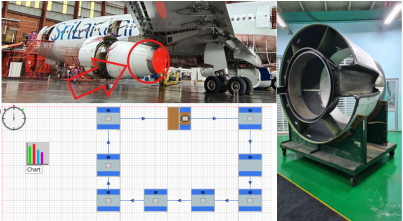

## Cooling Load Calculation
The cooling load calculation was done considering a lecture hall at the university permises. *CLF/ CLTD* method was followed for the calculation. 
* Following steps were carried out in order to obtain the cooling load
  - Building orientation and dimensioning
  - Equipment specification and buidling material study
  - Infiltration and Ventilation level
* Calculations were done under four (4) conditons;
  - 20% fresh air supply for 240C and 50% Relative Humidity (RH) internal conditions
  - 20% fresh air supply for 260C and 60% RH internal conditions
  - Without fresh air supply for 240C and 60% RH internal conditions
  - Without fresh air supply for 260C and 60% RH internal conditions

For more details: <a href = 'https://drive.google.com/file/d/1bV3eLeL3_9aTvYokfRnY4vk36gLXC4lT/view?usp=sharing'>Report</a>

## Wind Turbine Installation
There are several considerations that needed to be taken into account before the installation of a Wind Turbine, and these factors were identified and evaluated thoroughly through this project. *Rayleigh p.d.f.* was used in calculation.
* The following calculations and simulations were carried out;
  - Annual Energy Production (AEP) was calculated for two given Wind Turbine models with manufacturer specified data
  - Develop a site specific power controlling strategy for a given rotor
  - Simulations were done in Matlab considering both Fixed and Variable speed control mechancisms.

For more details: <a href = 'https://drive.google.com/file/d/1Gnd0FKxA4ZTBa9B6Nslx1XxEd3sePFnz/view?usp=sharing'>Report</a>

## Domestic Solar PV Installation
Sri lanka having high *Global Horizontal Irridiation* levels has the potential to generate power using solar panels to facilitate domestic power requirements. Through this project the parameters considered for a solar PV installation and related calculations were done considering personal residence location.

For more details: <a href = 'https://drive.google.com/file/d/1gwGWhjz6YKJC3xE-PbGSQ2dF-biislWH/view?usp=sharing'>Report</a>

## Converging - Diverging Nozzle 
Conducted analytical calculations in Matlab for a rocket to understand the practical implications of the Converging - Diverging Nozzle. 
* Calculations were carried out for Ideal and Real condtions using;
  - Tsiolkovsky rocket equation
  - Effective Exhaust Velocity
  - Study of Flow Behaviour
* The following conditions were studied;
  - Nozzle exit diameter variation with Altitude
  - Thrust variation with Altitude under Ideal conditions
  - Thrust variation with Altitude under General conditions

For more details: <a href = 'https://drive.google.com/file/d/1zWrn285JBv5S_wgo5yGRTE0HbHdkiXq0/view?usp=sharing'>Report</a>

## Production Efficiency Improvement Case Study 
The case study was performed at *Sri Lankan Airlines*. The process flow at the Composite Workshop was mainly focused. 
* The following tasks were carried out during the project. 
  - Gathering current process flow data during field visits
  - Literature study
  - Simulation of the current workflow using Technomatrix Plant Simulation software
  - Identifying potential improvements
  - Validating suggested improvements through simulation. 

For more details: <a href = 'https://drive.google.com/file/d/1-rdNiFEyi6RXJLYdyEuvXLL8eK_h2XcX/view?usp=sharing'>Report</a>

## Development of a Stock Monitoring Autonomous Forklift
Many compartmental systems can be represented by a series of first-order differential equations.
* Bolies Glucose/ Insulin Model
* Riggs Model for Iodine Metabolism

For more details: <a href = 'https://drive.google.com/file/d/1D8cFy-ad_XFkPkeByfzMhiE7XNZY3Tkx/view?usp=sharing'>Report</a>

<!-- ## Image Downsampling Processor -->
<!-- Designed and simulated/implemented a processor that could down-sample an input image using Vivado Design Suite. The input image was transmitted to the processor where the image was down-sampled and once finished, the results were sent back for display purposes. -->
<!-- 

 -->
<!-- 
      
 -->
<!-- 
Original and Downsampled Image
 -->

<!-- For more details: <a href = 'https://drive.google.com/file/d/17boW2Lucrl8q1lLBczsg5-FsFSRw2sct/view?usp=sharing'>Report</a> -->

<!-- ## Object Counting on a Moving Conveyor Belt -->
<!-- Hexagonal nuts on a moving conveyor belt were detected and localized from a video stream using a conventional image processing pipeline including; -->
<!-- * Otsu Thresholding
* Morphological Closing
* Connected Component Analysis
* Contour Analysis -->
<!-- 

 -->

<!-- For more details: <a href = 'https://drive.google.com/file/d/1A49N0SqSG2mHoBpuD9Ckj3xq1O-_QkWk/view?usp=sharing'>Report</a> -->