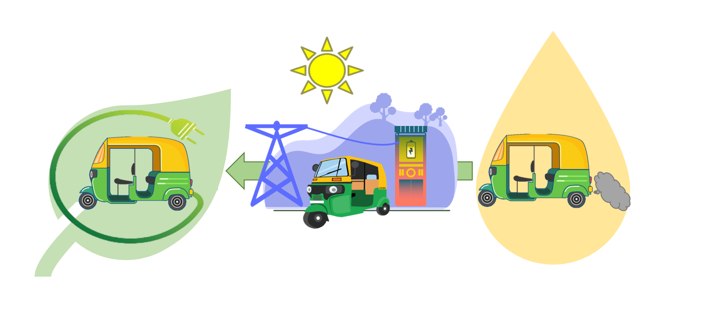

Project Zooxanthellea was first initiated in 2018 with the hopes of coral restoration in ____ area. Although the installation of coral structures and plantation of corals was a success, the growth rate during the observed period of 2018 - 2020 showcased to be minimal. Therefore, as the Co - director of Environmental services avenue of Rotaract Club of university of Moratuwa we understood the need to re-engineer coral structres. 
For this purpose I developed the following designs and obtained expert opinion on the two structures.

According to expert opinion the second structure was accepted and proceeded to construction. Project funding was provided by <b>Mitsubishi Cooperation</b>, which helped us to achieve a reliable structure. Furthermore, oceanographers from <b>Marine Environment Protection Authority (MEPA)</b> shared knowledge on coral plantation and carried out related tasks. Successful deposition of 20 structures was done around *Mirissa* Bay area. The first underwater monitoring session depicted a significant growth during the few months period after deposition.

